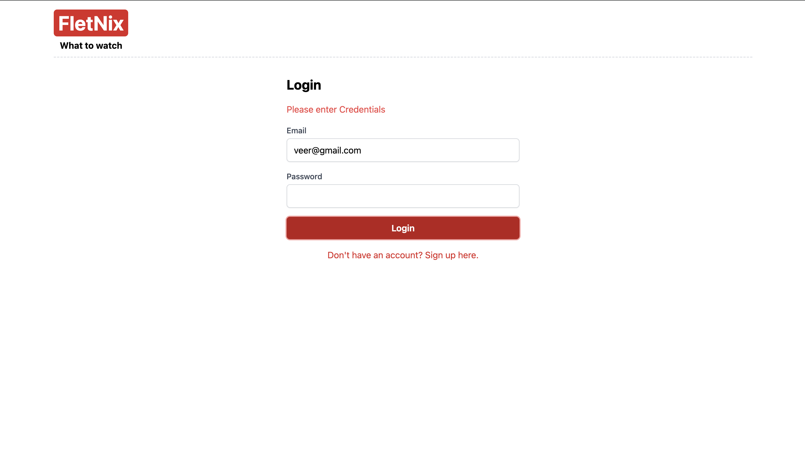
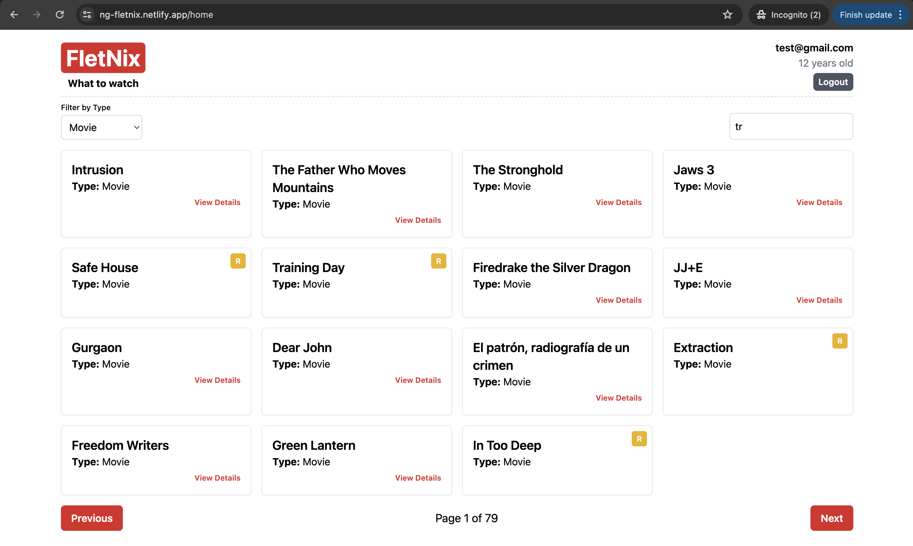
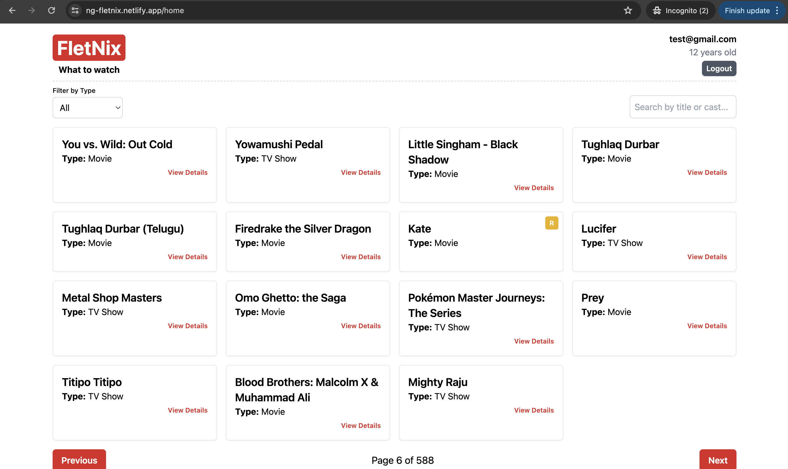
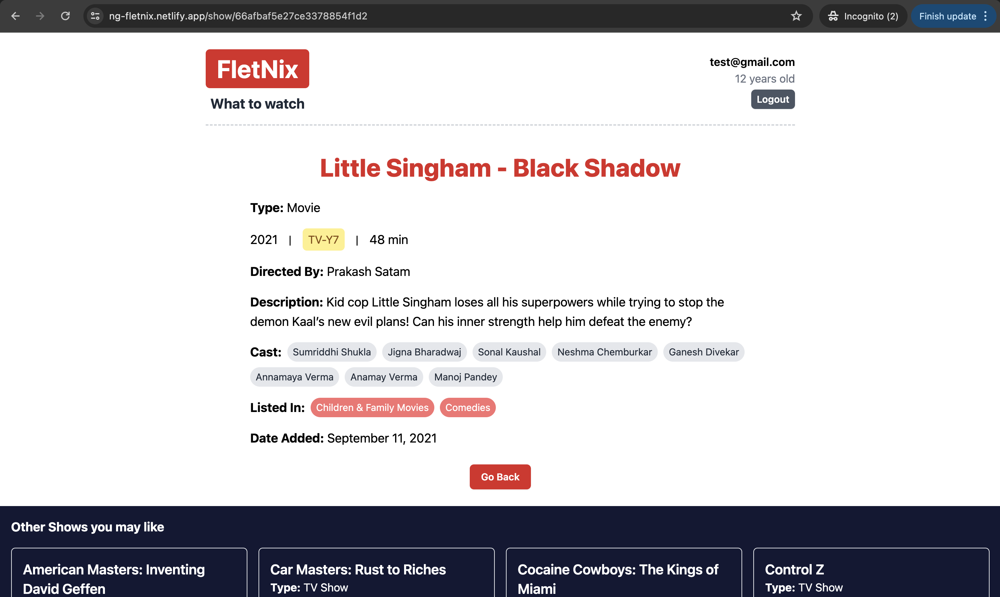
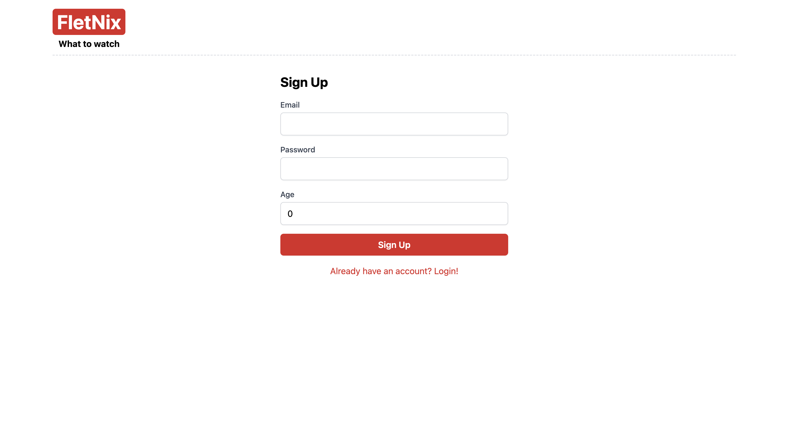

# ng-fletnix-frontend

Frontend Repository of Fletnix Webapp made using Angular 12+. This UI handles authentication, user details, and listing of TV shows and movies with pagination, filter, search functionality, and age-based content restrictions.

## Links

Before you start, here is the live link for the App. If you like the project, do give a star to the repo!

- [Live Link](https://ng-fletnix.netlify.app/) (Fletnix - What to Watch)
- [Backend Repo](https://github.com/veerprakash28/ng-fletnix-backend) (Repository of Backend made using Node and MongoDB)

## Prerequisites

Before you start, ensure you have the following installed:

- [AngularJs](https://angular.dev/) (v12+ or higher recommended)

## Setup Instructions

### 1. Clone the Repository

```bash
git clone https://github.com/veerprakash28/ng-fletnix-frontend.git
cd ng-fletnix-frontend
```

### 2. Install Dependencies

- Run the following command to install the required dependencies:

```bash
npm install
```

### 3. Configure Environment Variables

- Create a src/environments/environment.ts file and add the following configuration:

```bash
export const environment = {
  production: false,
  apiUrl: 'http://localhost:3000' // Update this to your backend API URL if different
};
```

### 4. Configure Environment Variables

- Start the development server by running:

```bash
ng serve
```

- The application will be running on http://localhost:4200 by default.

### For Testing

- Check the unit test cases and add more :P

```bash
ng test
```

## Features

### Authentication

- **Signup:** Users can create a new account with email, password, and age.
- **Login:** Users can log in with their email and password.
- **Logout:** Logged-in users can log out, which clears their session.

### User Details

- **Display:** Logged-in users will see their email and age displayed on the UI.
- **Redirect:** If a user is not logged in, they will be redirected to the login page.

### Search and Filter

- **Search:** Users can search for TV shows and movies by title or cast.
- **Filter:** Users can filter the list by type (TV Show or Movie).

### Show Details

- **Display:** Detailed information about each show is shown, including title, type, release year, rating, director, description, cast, country, and categories.
- **Age-Based Access:** Users under 18 cannot view 'R' rated shows or movies.

## Screenshots

### Fletnix - Login



### Fletnix - Search and Filter



### Fletnix - Pagination



### Fletnix - Details Page



### Fletnix - Signup



## Contributing

1. **Fork the repository** and create a new branch for your changes.
2. **Make your changes** and ensure that they do not break existing functionality.
3. **Submit a pull request** with a description of the changes and any relevant information.

## License

This project is licensed under the [MIT License](LICENSE) - see the `LICENSE` file for details.
